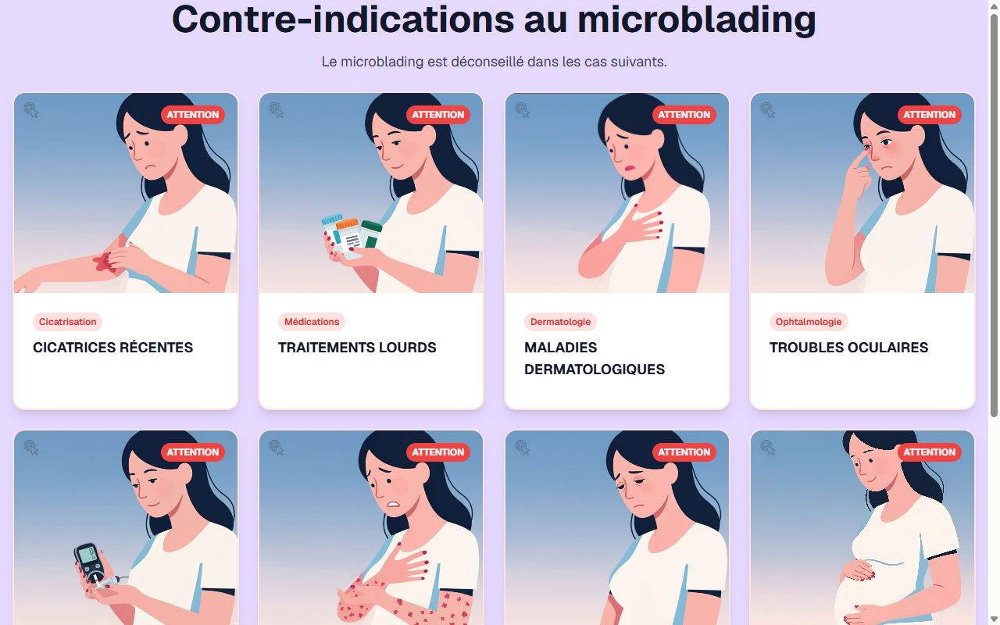

# Contre-indications — Microblading & Microblading EN (Shared)

**Course:** MICROBLADING & MICROBLADING (EN)  
**Slide:** 4  
**Live URL:** https://contreindiction-zy56.edtechiecorp.com  
**Stack:** Next.js · Tailwind CSS · TypeScript · GitHub Pages  

## What this slide does

Displays contraindications for the microblading procedure — conditions that prevent treatment such as pregnancy, active skin conditions, blood-thinning medications, and recent cosmetic procedures. Used across both the French and English microblading courses as a shared asset, ensuring consistent safety messaging regardless of learner language. Practitioners must be able to identify and communicate these contraindications during client consultations.

## Screenshot

## Usage

This slide is embedded as an iframe inside Coassemble at the live URL above. DNS is managed via Cloudflare (`edtechiecorp.com`). To update the slide, push to the `main` branch — GitHub Actions will rebuild and redeploy automatically.
